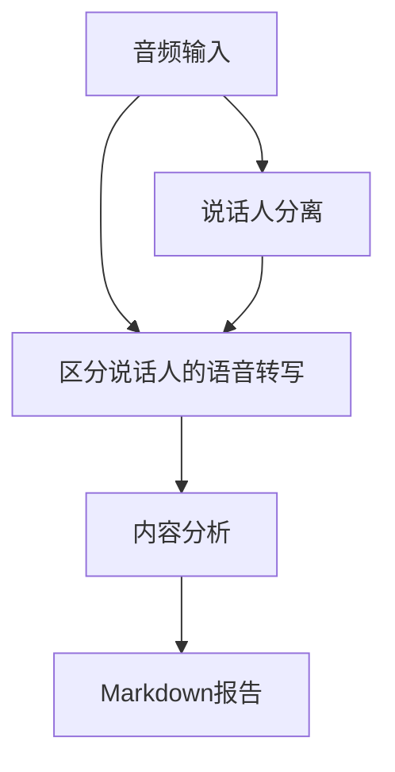
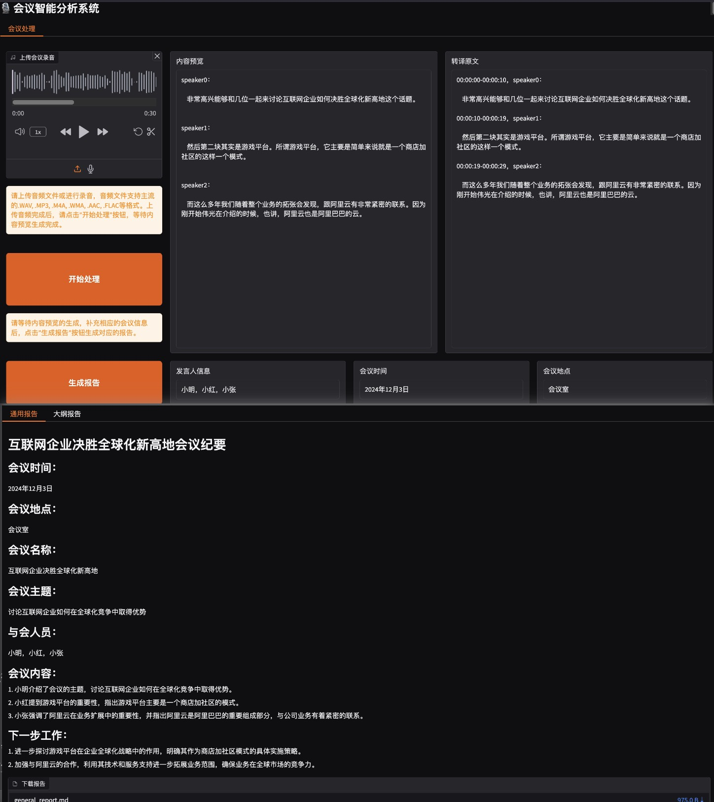

# 会议纪要自动生成系统

基于语音识别和自然语言处理技术，自动完成会议录音的说话人分离、内容转写和智能分析，通过 Gradio 搭建展示界面。

## 功能特性

- 🎙️ **说话人分离**：核心采用[CAM++说话人日志模型](https://www.modelscope.cn/models/iic/speech_campplus_speaker-diarization_common/summary)进行高精度说话人识别，同时使用[CAM++说话人确认](https://modelscope.cn/models/iic/speech_campplus_sv_zh-cn_16k-common/summary)实现对长音频段的说话人识别。
- 📝 **语音转写**：集成Whisper模型实现语音转写，使用[CT-Transformer标点](https://modelscope.cn/models/iic/punc_ct-transformer_cn-en-common-vocab471067-large/summary)、[BERT文本分割](https://www.modelscope.cn/models/iic/nlp_bert_document-segmentation_chinese-base)。
- 🤖 **智能分析**：通过OpenAI API提取生成会议纪要的通用形式、大纲形式。
- 📊 **可视化输出**：生成结构化Markdown格式报告。


处理流程说明：
1. **顺序处理**：
   - 说话人分离（Speaker Diarization）
   - 语音转写（ASR Transcription）
2. **数据整合**：
   - 合并时间戳对齐的说话人标签和转写文本
3. **分析输出**：
   - 生成结构化会议记录
   - 执行LLM内容分析

## 快速开始

操作环境：`linux`
可通过`docker`或`常规配置`的方式进行搭建。

*可以参考以下配置方式进行环境配置：*

### 运行流程

1. 拉取镜像
```bash
docker pull --platform linux/amd64 python:3.11
```

2. 验证镜像
```bash
docker images | grep python
```

3. 创建容器 (需修改路径)
```bash
docker run -itd \
  --platform linux/amd64 \
  -p 7860:7860 \
  -v /your-path-to-meeting-minutes-folder:/app \
  --name meeting_minutes \
  python:3.11
```

4. 验证容器
```bash
docker ps -a | grep meeting_minutes
```

5. 进入容器配置
```bash
docker exec -it meeting_minutes bash
cd app

# 配置环境变量 (复制后需对.env更改)
cp .env.example .env

# 安装依赖
apt-get update && apt-get install -y libsox-dev
apt install ffmpeg
pip install -r requirements.txt
whisper download medium
pip install modelscope[audio] -f https://modelscope.oss-cn-beijing.aliyuncs.com/releases/repo.html

# 运行代码 (以Gradio方式为例)
python main.py
```

#### 关于报错

1. `libsox`与`pytorch`相关：
```bash
OSError: libsox.so: cannot open shared object file: No such file or directory
```

根据[Hugging Face 讨论](https://huggingface.co/spaces/facebook/seamless-streaming/discussions/32)：

```bash
apt-get update && apt-get install -y libsox-dev
pip uninstall torchaudio
pip install torchaudio
```
---

### 使用常规配置

#### 安装依赖
```bash
pip install -r requirements.txt
```

#### 配置环境变量
```bash
cp .env.example .env
```

对`.env`进行修改，配置对应的`OPENAI_API_KEY`和系统提示词路径（例如`SYSTEM_PROMPT_PATH=/app/.system_prompt.txt`）。
亦可直接修改`analyze_transcript.py`配置不同LLM模型。

---

### 对于Gradio的方式

#### 运行程序
```bash
python main-gradio.py
```

#### 查看Gradio界面

对于docker容器中运行的程序，可部署在 `0.0.0.0`，以供宿主机通过 `localhost` 对应端口进行监听。

#### 使用示例



*图：会议纪要生成系统的Gradio交互界面*

#### 输入要求
- 支持格式：MP3, WAV等格式音频文件
- 默认示例：`/sample-diarization-test.wav`
- 备用URL：自动回退到阿里云示例音频

---

## 注意事项

1. 首次使用需配置`.env`文件设置API密钥与路径

## 许可协议

Apache License 2.0