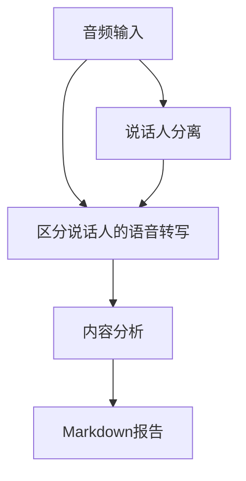
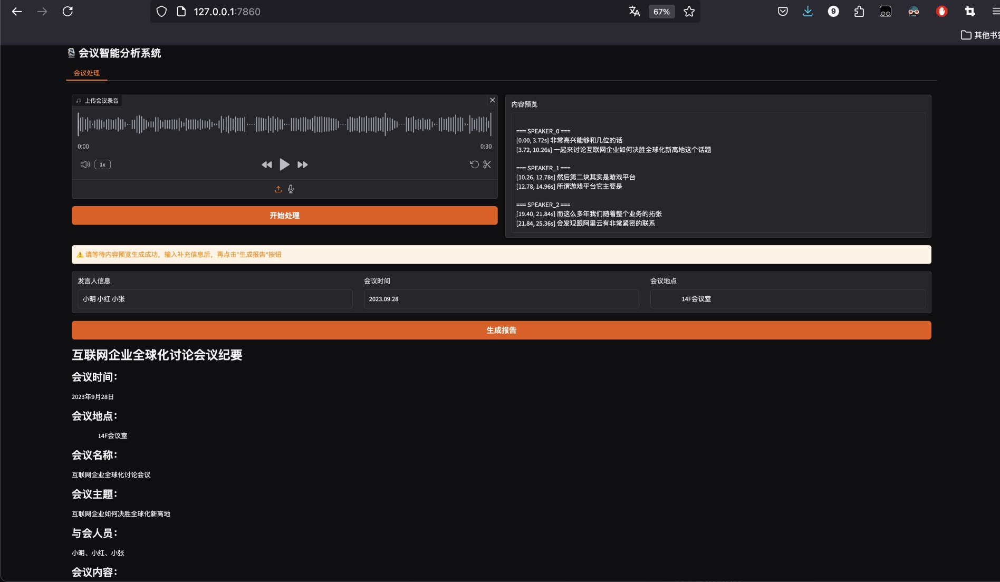
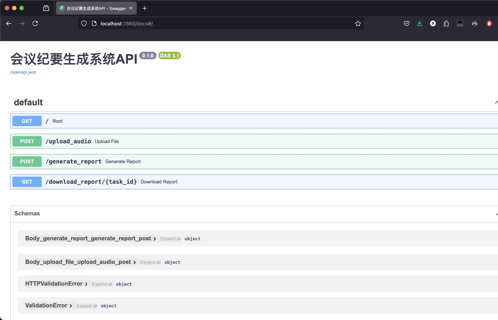

# 会议纪要自动生成系统

基于语音识别和自然语言处理技术，自动完成会议录音的说话人分离、内容转写和智能分析。
其中，`main-terminal.py`通过终端输入进行交互；`main-gradio.py`通过Gradio在本地端口构建了可供demo的界面；`main.py`通过[FastAPI](https://fastapi.tiangolo.com/)提供接口，以便后续开发使用。

## 功能特性

- 🎙️ **说话人分离**：采用[ModelScope的CAM++说话人日志模型](https://www.modelscope.cn/models/iic/speech_campplus_speaker-diarization_common/summary)进行高精度说话人识别
- 📝 **语音转写**：集成Whisper模型实现语音转写
- 🤖 **智能分析**：通过DeepSeek API自动提取会议重点和行动项
- 📊 **可视化输出**：生成结构化Markdown格式报告


处理流程说明：
1. **顺序处理**：
   - 说话人分离（Speaker Diarization）
   - 语音转写（ASR Transcription）
2. **数据整合**：
   - 合并时间戳对齐的说话人标签和转写文本
3. **分析输出**：
   - 生成结构化会议记录
   - 执行LLM内容分析

## 快速开始

可通过`docker`或`常规配置`的方式进行搭建。

---

### 使用docker

#### 终端操作步骤

1. 拉取镜像
```bash
docker pull --platform linux/amd64 python:3.11
```

2. 验证镜像
```bash
docker images | grep python
```

3. 创建容器 (需修改路径)
```bash
docker run -itd \
  --platform linux/amd64 \
  -p 7860:7860 \
  -v /your-path-to-meeting-minutes-folder:/app \
  --name meeting_minutes \
  python:3.11
```

4. 验证容器
```bash
docker ps -a | grep meeting_minutes
```

5. 进入容器配置
```bash
docker exec -it meeting_minutes bash
cd app

# 配置环境变量 (复制后需对.env更改)
cp .env.example .env

# 安装依赖
apt-get update && apt-get install -y libsox-dev
apt install ffmpeg
pip install -r requirements.txt
whisper download medium
pip install modelscope[audio] -f https://modelscope.oss-cn-beijing.aliyuncs.com/releases/repo.html

# 运行代码 (以Gradio方式为例)
python main-gradio.py
```

#### 关于报错

1. `libsox`与`pytorch`相关：
```bash
OSError: libsox.so: cannot open shared object file: No such file or directory
```

根据[Hugging Face 讨论](https://huggingface.co/spaces/facebook/seamless-streaming/discussions/32)：

```bash
apt-get update && apt-get install -y libsox-dev
pip uninstall torchaudio
pip install torchaudio
```

---

### 使用常规配置

#### 安装依赖
```bash
pip install -r requirements.txt
```

#### 配置环境变量
```bash
cp .env.example .env
```

对`.env`进行修改，配置对应的`DEEPSEEK_API_KEY`和系统提示词路径（例如`SYSTEM_PROMPT_PATH=/app/.system_prompt.txt`）。
亦可直接修改`llm_analyzer.py`配置不同LLM模型。

---

#### 对于Terminal的方式

#### 运行程序
```bash
python main-terminal.py
```

#### 输入要求
- 支持格式：MP3, WAV等格式音频文件
- 默认示例：`/sample-diarization-test.wav`
- 备用URL：自动回退到阿里云示例音频
- 提供了示例音频样例，如需对自己的音频进行分析，应修改`main-terminal.py`中`input_file = "/app/sample-diarization-test.wav"`内容至对应音频路径。

#### 输出文件
1. `meeting_transcript.txt` - 原始转录文本（含说话人标签）
2. `meeting_analysis.md` - 结构化分析报告

#### 使用示例

```bash
python main-terminal.py

# 输出示例
[1/4] 说话人识别
[2/4] 转译会议记录
[3/4] 输入说话人信息
=== SPEAKER_00 ===
[2.74, 3.72s] 我们开始今天的会议...

请输入对应的发言人
对应的说话人分别为:
[4/4] 生成会议纪要
分析结果已保存到 meeting_analysis.md

输出文件:
- 原始记录: meeting_transcript.txt
- 分析报告: meeting_analysis.md

结果预览：
...
```

---

#### 对于Gradio的方式

#### 运行程序
```bash
python main-gradio.py
```

#### 查看Gradio界面

对于docker容器中运行的程序，可部署在 `0.0.0.0`，以供宿主机通过 `localhost` 对应端口进行监听。

#### 使用示例



*图：会议纪要生成系统的Gradio交互界面*

#### 输入要求
- 支持格式：MP3, WAV等格式音频文件
- 默认示例：`/sample-diarization-test.wav`
- 备用URL：自动回退到阿里云示例音频

#### 输出文件
1. `meeting_transcript.txt` - 原始转录文本（含说话人标签）
2. `meeting_analysis.md` - 结构化分析报告

---

#### 对于FastAPI的方式

#### 运行程序
```bash
python main.py
```

#### 查看FastAPI接口文档

对于docker容器中运行的程序，可部署在 `0.0.0.0`，以供宿主机通过 `localhost` 对应端口进行监听。
可在 `localhost:7860/docs` 通过FastAPI接口文档对对应接口进行测试。

#### 使用示例



*图：会议纪要生成系统的FastAPI交互界面*

#### 输入要求
- 支持格式：MP3, WAV等格式音频文件
- 默认示例：`/sample-diarization-test.wav`
- 备用URL：自动回退到阿里云示例音频

#### 输出文件
- 根据创建的```task_id```，在`/cache`目录下创建以下文件：
  1. 用户上传音频：`{task_id}_full.wav`
  2. 带说话人识别的会议音频转译：`{task_id}_full.txt`
  3. 结合用户输入的说话人等信息，生成<b>LLM</b>的用户提示词：`{task_id}_user_prompt.txt`
  4. 最终生成的会议纪要报告：`{task_id}_report.md`

---

## 核心组件

| 模块 | 功能 | 技术基础 |
|------|------|----------|
| `speaker_distinction.py` | 说话人分离 | [CAM++模型](https://www.modelscope.cn/models/iic/speech_campplus_speaker-diarization_common/summary) |
| `speaker_transcript.py` | 语音转写 | Whisper-medium |
| `llm_analyzer.py` | 内容分析 | DeepSeek API |


## 注意事项

1. 首次使用需配置`.env`文件设置API密钥与路径

## 许可协议

Apache License 2.0