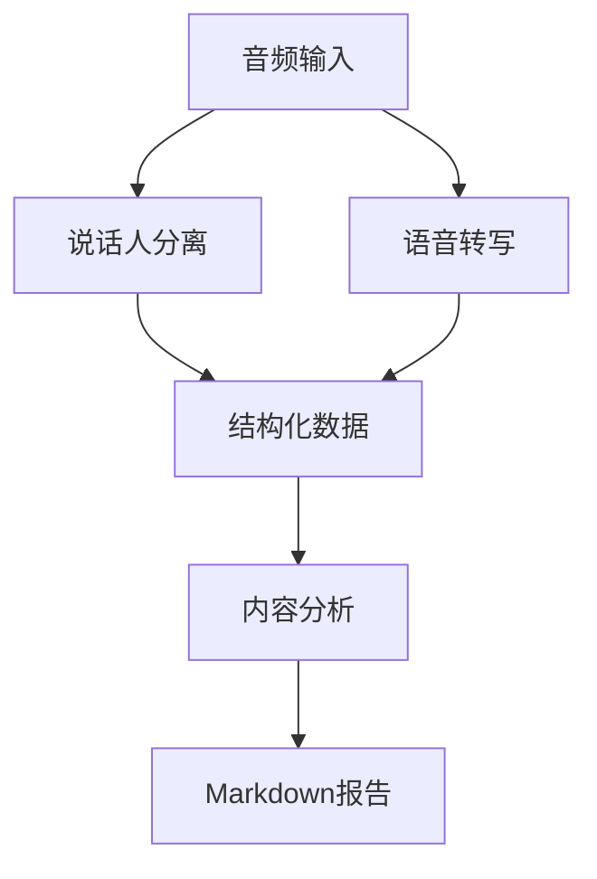

# 会议纪要自动生成系统

基于语音识别和自然语言处理技术，自动完成会议录音的说话人分离、内容转写和智能分析。

## 功能特性

- 🎙️ **说话人分离**：采用[ModelScope的CAM++说话人日志模型](https://www.modelscope.cn/models/iic/speech_campplus_speaker-diarization_common/summary)进行高精度说话人识别
- 📝 **语音转写**：集成Whisper模型实现语音转写
- 🤖 **智能分析**：通过DeepSeek API自动提取会议重点和行动项
- 📊 **可视化输出**：生成结构化Markdown格式报告


处理流程说明：
1. **并行处理**：
   - 说话人分离（Speaker Diarization）
   - 语音转写（ASR Transcription）
2. **数据整合**：
   - 合并时间戳对齐的说话人标签和转写文本
3. **分析输出**：
   - 生成结构化会议记录
   - 执行LLM内容分析

## 快速开始

### 安装依赖
```bash
pip install -r requirements.txt
```

### 运行程序
```bash
python main.py
```

## 输入输出说明

### 输入要求
- 支持格式：WAV格式音频文件
- 默认示例：`/app/sample-diarization-test.wav`
- 备用URL：自动回退到阿里云示例音频

### 输出文件
1. `meeting_transcript.txt` - 原始转录文本（含说话人标签）
2. `meeting_analysis.md` - 结构化分析报告

## 核心组件

| 模块 | 功能 | 技术基础 |
|------|------|----------|
| `speaker_distinction.py` | 说话人分离 | [CAM++模型](https://www.modelscope.cn/models/iic/speech_campplus_speaker-diarization_common/summary) |
| `speaker_transcript.py` | 语音转写 | Whisper-medium |
| `llm_analyzer.py` | 内容分析 | DeepSeek API |

## 使用示例

```bash
# 处理本地音频
python main.py

# 输出示例
[1/4] 说话人识别
[2/4] 转译会议记录
[3/4] 输入说话人信息
=== SPEAKER_00 ===
[2.74, 3.72s] 我们开始今天的会议...

请输入对应的发言人
对应的说话人分别为:
[4/4] 生成会议纪要
分析结果已保存到 meeting_analysis.md

输出文件:
- 原始记录: meeting_transcript.txt
- 分析报告: meeting_analysis.md

结果预览：
...
```

## 注意事项

1. 首次使用需配置`.env`文件设置API密钥

## 许可协议

Apache License 2.0
